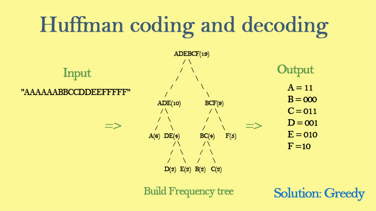

# Pypress

Huffman encoding is a widely used technique in data compression that allows you to represent data more efficiently by assigning shorter binary codes to more frequent symbols and longer binary codes to less frequent symbols.

1. ### Symbol Frequency Analysis:

Huffman encoding starts with an analysis of the frequency of symbols (characters or data elements) in the input data to be compressed.

More frequent symbols are assigned shorter codes, while less frequent symbols are assigned longer codes. This is the key to Huffman encoding's efficiency.

2. ### Binary Tree Construction:

A binary tree, called the Huffman tree, is constructed to represent the codes for each symbol.

The tree is built in such a way that symbols with higher frequencies are closer to the root of the tree, while symbols with lower frequencies are deeper in the tree.

3. ### Code Assignment:
To assign binary codes to symbols, you traverse the Huffman tree.

When moving to the left child of a node, a '0' is appended to the code, and when moving to the right child, a '1' is appended.

The path from the root to each leaf node corresponds to the binary code for a symbol.

4. ### Unique Prefix Property:

One crucial feature of Huffman codes is that they have the "unique prefix property," meaning that no code for one symbol is a prefix of the code for another symbol.

This property ensures that the codes are decodable without ambiguity.

5. ### Compression:
Once the Huffman tree and codes are constructed, the original data is encoded using these codes.

The compressed data is generally smaller in size than the original data because frequently occurring symbols are represented by shorter codes.

6. ### Decompression:
To decompress the data, the same Huffman tree is used to reverse the encoding process.

Starting at the root of the Huffman tree, you traverse it according to the encoded binary data until a leaf node is reached, which represents a decoded symbol.

## Space Complexity:

Huffman Tree: The primary space complexity in Huffman encoding is associated with the construction and storage of the Huffman tree. The space required for the tree is typically O(N), where N is the number of unique symbols in the input data. In the worst case, if every symbol is unique, the space complexity could be O(NlogN).

## Time Complexity:

Frequency Analysis: The time complexity of analyzing the frequency of symbols in the input data is O(N), where N is the size of the data.

Huffman Tree Construction: Building the Huffman tree involves constructing a binary tree and combining nodes based on their frequencies. The time complexity of this step is typically O(N log N), where N is the number of unique symbols.

Code Assignment: Assigning codes to symbols involves traversing the Huffman tree, which can be done in linear time. The time complexity for this step is O(N), where N is the number of unique symbols.

Compression and Decompression: The time complexity of compressing and decompressing the data is linear, O(M), where M is the size of the input data.

--

## In the given files we can see the compressed random.bin file that is created from random.txt file 
### random.txt : 21488 bytes
### random.bin : 12421 bytes

